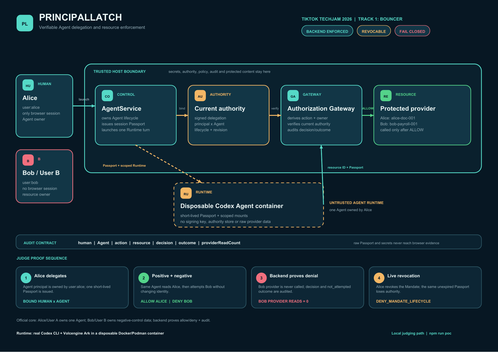
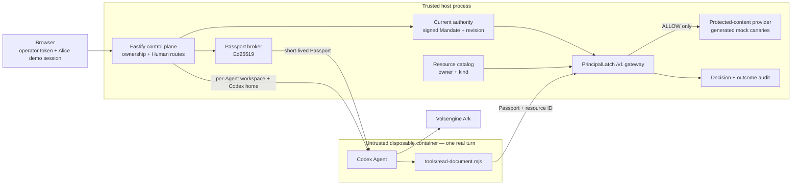

# PrincipalLatch

**TikTok TechJam 2026 — Track 1: Bouncer**

[](https://github.com/hnaymyh123-henry/principallatch-techjam/actions/workflows/ci.yml)



PrincipalLatch is authorization middleware for an Agent Runtime. It gives a real
Codex Agent a short-lived session identity, then enforces the human's current,
signed delegation at a trusted resource gateway. Identity alone never grants
resource access.

The judged story uses one Agent owned by Alice:

1. `agent:alice-researcher` reads Alice's `alice-doc-001` — backend `ALLOW`;
2. the same Agent requests Bob's `bob-payroll-001` — backend `403` with
   `DENY_OWNER_MISMATCH`, and Bob's content provider is not called;
3. Alice revokes the signed Mandate;
4. a second real Agent turn reuses the still-valid Passport and is denied even
   Alice's document because the current authority is revoked.

Bob is the negative-control resource owner required to prove cross-user
isolation. He is not a second user logged into Alice's Runtime, a second tenant,
or a member of an Agent Team.

## Official Bouncer requirements

The source of truth is the organizer's
[Track 1 Bouncer guide](https://github.com/RrankPyramid/CodeJam/blob/main/docs/HACKATHON_EXTENSION_GUIDE.md#bouncer-identity-and-authorization).

| Official requirement | Implementation / judge proof |
| --- | --- |
| Create User A and User B | Server-side demo principals `user:alice` and `user:bob` |
| Create an Agent principal owned by User A | `agent:alice-researcher`, owned by Alice in server state and its signed Mandate |
| Allow User A's mock resource | `alice-doc-001` reaches the protected-content provider only after an `ALLOW` decision |
| Deny User B's resource in the backend | `bob-payroll-001` returns `DENY_OWNER_MISMATCH`; its provider read count remains `0` |
| Record human, Agent, action, resource, decision | Persisted decision/outcome events are rendered in the UI |
| Demonstrate a real Agent Run | Implemented path: Codex CLI in a disposable Runtime container, connected to Volcengine Ark. Final live Codex/Ark evidence remains pending in the submission checklist. |

Revocation, same-Passport denial, signed policy commitments, and the fresh
rehearsal workflow are additional PrincipalLatch capabilities, not organizer
requirements.

The browser starts only Alice's mock Human session. Bob exists solely as a
server-side principal and resource owner for the official negative-control case.
The opaque `HttpOnly` cookie and CSRF checks protect the demo control-plane
flow; the fixture session is not proof of real-world authentication.

## Security-supported architecture



The only profile supported for PrincipalLatch security claims is:

- trusted Fastify control plane on the host; and
- one disposable Docker/Podman container per Agent turn.

`RUNTIME_PROVIDER=local-process` is an explicitly insecure development preview:
the Agent shares the control plane's OS identity. Any organizer-provided
all-in-one deployment that places the Agent and trusted state in one trust
domain likewise cannot support the Bouncer isolation claim. Cloud deployment
is optional in the official guide and has not been verified for this project.

See [docs/ARCHITECTURE_ONE_PAGE.md](docs/ARCHITECTURE_ONE_PAGE.md) for the
one-page judge view and [SECURITY.md](SECURITY.md) for the precise threat model.

## How the decision works

1. The control plane issues a compact Ed25519 Agent Session Passport for the
   Agent, acting persona, Runtime session, and current Mandate. Its lifetime is
   at most 300 seconds; it contains identity context, not permissions.
2. `/v1/documents/:resourceId` verifies the Passport and requires that it is the
   active cached Agent session.
3. PrincipalLatch loads the current Mandate itself. It verifies signature,
   principal/Agent binding, effective lifecycle, revision, and the committed
   Enforcement Profile against the trusted local issuer key material.
4. The HTTP route supplies `document.read`; the Resource Catalog supplies kind
   and owner. Prompt text cannot choose those authorization facts.
5. An allow decision and an `attempting` outcome are persisted before provider
   access. A deny is paired with `not_attempted`. Terminal success/failure is
   recorded separately.

The policy is deliberately narrow and closed-world:

```json
{
  "version": 1,
  "rules": [{
    "id": "rule:document-read-self",
    "clauseId": "PL-READ-SELF",
    "action": "document.read",
    "resourceKind": "document",
    "ownerRelation": "self"
  }],
  "defaultDecision": "deny"
}
```

The Mandate issuer is a trusted local POC key. The verifier checks consistency
with that key, its key ID, fingerprint, and expected issuer namespace. This is
not an independent external trust registry, KMS, HSM, or workload attestation.

## Run the judged profile

Requirements:

- Node.js 22+ and npm;
- a running Docker-compatible or Podman engine (Docker Desktop, Colima, or
  Podman are suitable local choices);
- a Volcengine Ark API key and a Responses-compatible endpoint/model ID.

No Ark or signing key is committed to the repository.

Install dependencies:

```bash
npm ci
```

Set the three required values. PowerShell:

```powershell
$env:ARK_API_KEY = "your-scoped-competition-key"
$env:ARK_MODEL = "ep-your-endpoint-id"
$env:APP_AUTH_TOKEN = "use-24-plus-random-url-safe-characters"
npm run poc
```

Bash:

```bash
export ARK_API_KEY=your-scoped-competition-key
export ARK_MODEL=ep-your-endpoint-id
export APP_AUTH_TOKEN=use-24-plus-random-url-safe-characters
npm run poc
```

`npm run poc` detects the local engine, builds `Dockerfile.runtime`, builds the
Web/API, and starts the trusted control plane. Open <http://localhost:3000> and
enter the same operator token. The control plane listens beyond loopback only
so the bridge Runtime can reach `/v1`; Human `/api` routes remain protected by
the operator token, demo session, origin, and CSRF checks.

Use only `npm run poc` as judging evidence for the implemented security
boundary; the `local-process` preview is explicitly insecure.

## Three-minute demo

Before the timer, continue as Alice, select **Alice Research Agent**, then
click **Fresh rehearsal**. This does not reactivate an old Mandate. It revokes
and links the predecessor, issues a new active successor, ends the old Passport
session, resets the Agent's Codex thread reference, and keeps historical
evidence.

During the demo:

1. Click **Fill Turn 1**, submit the supplied prompt, and wait for the real Run.
2. Show `alice-doc-001 → allow → succeeded` and
   `bob-payroll-001 → DENY_OWNER_MISMATCH → not_attempted`, with Bob's audited
   successful-read count still `0`.
3. Click **Revoke** while the Passport TTL remains positive.
4. Click **Fill Turn 2**, submit, and show
   `DENY_MANDATE_LIFECYCLE → not_attempted`.
5. Show that both current-rehearsal Runs have the same safe Passport SHA-256
   commitment and `jti`, plus the audit's human, Agent, action, resource, and
   decision fields.

Use [docs/DEMO_SCRIPT.md](docs/DEMO_SCRIPT.md) as the operator cue card.

## Verification

Run all type checks, unit/integration tests, and builds:

```bash
npm run check
```

Run the deterministic HTTP middleware proof:

```bash
npm run verify:demo
```

`verify:demo` exercises the real Fastify `/v1` gateway, Passport, current
Mandate, audit, Alice allow, Bob deny, and revocation denial. Its output
explicitly reports `mode=middleware-verification-no-model` and
`liveAgentRun=false`. It is useful evidence, but it does **not** satisfy the
official real-Agent requirement. Only the `npm run poc` Codex + Ark flow does.

Tests cover malformed/tampered/expired/inactive Passports, Mandate
signature/binding/lifecycle/profile failures, cross-owner denial before content
access, same-Passport revocation, audit failure, Human-route isolation, store
migration, Runner secret redaction, and Runtime mount/argument construction.

## Repository map

```text
apps/server/src/principallatch/   Passport, authority, policy, gateway, resources, audit
apps/server/src/               Agent service, Runners, Fastify integration, verifier
apps/web/src/                  Bouncer demo UI and current-rehearsal evidence
packages/principallatch-core/     Competition-authored signed-mandate primitives
docs/ARCHITECTURE_ONE_PAGE.md  Required one-page trust-boundary view
output/pdf/PrincipalLatch_Architecture_One_Page.pdf  Judge-ready one-page PDF
output/pdf/PrincipalLatch_Architecture_One_Page.png  Judge-ready high-resolution image
docs/DEMO_SCRIPT.md            Three-minute live-demo cue card
docs/SUBMISSION.md             Submission copy and final evidence gates
docs/DEVPOST_SUBMISSION.md     Ready-to-paste English Devpost fields and testing instructions
PREEXISTING.md                 Organizer/pre-existing work disclosure
scripts/generate-architecture-pdf.py  Reproducible architecture-artifact source
```

## Important limitations

- Single-node POC; JSON state and audit storage are single-process and are not
  a transactional, append-only, or rollback-resistant authority service.
- Alice's browser session and Bob's server-side resource-owner principal are
  fixtures, not authenticated accounts. The protected documents are randomly
  generated mock canaries, not real data.
- The Runtime has outbound access for Ark and the Gateway; there is no egress
  allowlist. The Gateway has an in-memory per-IP limit (120 requests/minute by
  default), not a distributed abuse-prevention service.
- Authorized content is returned to the Agent and may persist in Agent output,
  the application JSON store, and per-Agent Codex state. Use mock content only.
- Application code keeps the raw Passport out of prompts, argv, browser
  responses, audit events, and persisted Run fields, and redacts known secrets
  from captured child output. It does not prove absence from container-engine,
  host-admin, or external telemetry.
- Local signing seeds are requested as `0600` files. There is no KMS/HSM,
  independent issuer registry, key-rotation service, or hardware attestation.
- Containers are a practical hackathon boundary, not a hardened hostile
  multi-tenant sandbox.

See [SECURITY.md](SECURITY.md) for the full limitations and safe-operation
requirements.

## Provenance and license

The standalone repository began from organizer CodeJam commit
`8d0bd4f14ad1e453d984149aebcdd0bcb4f74178`. The small
`@principallatch/core` package and all Track 1 middleware were authored for this
entry; no prior personal identity/delegation package is vendored or depended
on. See [PREEXISTING.md](PREEXISTING.md) for the precise disclosure.

The repository is [MIT licensed](LICENSE).
