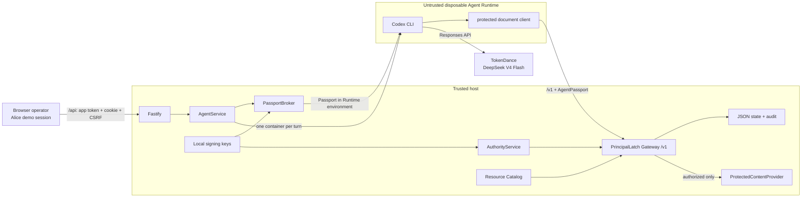

# PrincipalLatch architecture

PrincipalLatch extends the organizer's CodeJam Agent Starter Kit for **TikTok
TechJam 2026 — Track 1: Bouncer**. The product boundary is the protected
resource Gateway: the model may request a resource, but only trusted middleware
can turn that request into a content read.

## Supported deployment



The trusted Fastify process runs on the host. Each real Agent turn runs in a
separate disposable Docker/Podman container. The Runtime receives only its
Agent workspace, per-Agent Codex home, model key, short-lived Passport, and
Gateway URL. It does not receive the control-plane repository, JSON store,
signing-key directory, or protected-content file.

This is the sole security-supported profile. Host `local-process` and any
all-in-one execution share the trusted OS/container domain and are not valid
evidence for the isolation claim. Cloud deployment is optional under
the track rules and is currently unverified.

## Principals and credentials

| Object | Concrete demo value | Meaning |
| --- | --- | --- |
| User A | `user:alice` | Browser demo session, Agent owner, owner of Alice document |
| User B | `user:bob` | Server-side negative-control principal and owner of Bob document; no browser login |
| Agent | `agent:alice-researcher` | Independent Agent principal owned by Alice |
| Passport | Compact Ed25519 JWS, max 300 seconds | Active Agent session identity acting for Alice; no permissions |
| Mandate | `principal × agent` signed record | Current delegated authority, lifecycle, revision, and profile commitment |

Bob is not logged into Alice's Runtime. The main demo does not require Bob to
run an Agent or participate in a team. His resource exists to prove that the
backend rejects Alice's Agent at the user boundary.

The browser entry creates only Alice's opaque demo session. Bob remains a
server-side principal/resource-owner fixture and has no session route. Alice's
session is protected by cookie/origin/CSRF controls, but it is not real
authentication. The shared operator token protects access to the local demo
and is not a principal claim.

## Request decision path

For `GET /v1/documents/:resourceId`:

1. **Verify the Agent Passport.** Require the exact JWS header and strict claims;
   verify signature, issuer, audience, time window, and that its `jti` is the
   active session cached for this Agent. Failure occurs before catalog lookup.
2. **Load current authority.** Ignore any Runtime-supplied policy or Mandate.
   Load the stored current record named by the Passport and verify signature,
   revision, exact principal/Agent binding, and effective lifecycle.
3. **Check local issuer consistency.** Match the expected issuer namespace,
   public key, key ID, and fingerprint against the trusted local key material.
   This is not an independently anchored trust registry or HSM.
4. **Verify the profile commitment.** Recompute the canonical,
   domain-separated commitment to Enforcement Profile v1. Unknown or changed
   profiles deny.
5. **Derive protected facts.** Route/method define `document.read`; the trusted
   catalog defines `document` and its owner. Prompt/request text cannot assert
   ownership.
6. **Persist before access.** A deny is atomically recorded with
   `ResourceOutcome=not_attempted`. An allow and `attempting` outcome are
   recorded before the provider call; terminal `succeeded` or `failed` follows.
   If the pre-access write fails, the provider is not called. If only the
   terminal write fails after a provider attempt, the API preserves the
   recorded `allow` and reports an `indeterminate` outcome instead of inventing
   a deny; production recovery would require a transactional outbox and
   provider receipt/idempotency protocol.
7. **Return content only on allow.** The provider reads the generated mock
   canary only after the allow-side audit write succeeds.

The closed-world rule is `document.read` on a `document` whose owner is the
acting principal (`self`). All unknown actions, resource kinds, owner relations,
profiles, credentials, and authority states deny.

## Control plane and Runtime lifecycle

`AgentService` owns Agent CRUD, Human ownership checks, Runs, workspace repair,
and one-active-Run serialization.

```text
Agent:      ready ──run──> busy ──complete──> ready
              │             ├──failure────> error
              │             │
              └──stop──────> stopped <──cancel

Demo proof: ready_turn_1 -> ready_revoke -> ready_turn_2 -> complete
```

The proof state is derived from persisted audit evidence for the Agent's
**current Mandate**, not from button clicks or model prose. Turn 1 requires an
Alice allow/success and Bob deny/not-attempted using the same Passport. After
revocation, Turn 2 requires a lifecycle deny/not-attempted with that still-active
Passport. Revocation itself remains available as a security control even if the
guided demo phase is not ready.

Each turn gets a new disposable container, while the per-Agent workspace,
per-Agent Codex home, and stored Codex thread ID allow the Agent session to
continue. The Passport broker reuses the active Passport until it expires or is
explicitly invalidated. Stop, delete, and fresh rehearsal invalidate it.

## Fresh rehearsal transaction

Fresh rehearsal is available only for the permanent seeded demo Agent and
refuses to run while it is busy. It does not reactivate a revoked record:

1. verify the expected current Mandate ID and revision;
2. issue a signed revoked predecessor revision linked to `replaced_by`;
3. issue a new signed active successor linked to `replaces`;
4. atomically update the Agent to the successor;
5. end the prior Passport session, clear the stored Codex thread reference,
   reinstall the managed workspace files, and reset in-memory provider counts;
6. retain old Runs, messages, Mandates, and audit history while the UI scopes
   current proof to the successor Mandate.

## Data placement

| Location | Data | Trust notes |
| --- | --- | --- |
| `APP_DATA_DIR/principallatch.json` | Agents, messages, Runs, current authority records, Gateway audit | Trusted single-process JSON; atomic file replacement, not a database |
| `APP_DATA_DIR/principallatch-keys/` | Passport and Mandate Ed25519 seeds | Trusted host only; local files request restrictive modes |
| `APP_DATA_DIR/principallatch-protected-content.json` | Per-deployment random Alice/Bob canaries | Trusted host only; never mounted to Runtime |
| `AGENT_WORKSPACE_ROOT/<agent-id>/` | Agent files and protected-resource client | Only selected Agent path is mounted |
| `CODEX_HOME/agents/<agent-id>/` | Generated provider config and Codex session state | Only selected Agent path is mounted; may retain authorized content |
| Runtime environment | Scoped model key, Passport, Gateway URL | Ephemeral bearer secrets; observable to engine/host administrators |

Application state persists only safe Passport commitments (`jti`, expiry, and
SHA-256), not the compact JWS. Known secrets are redacted from captured child
output. Authorized content may legitimately appear in Agent output, messages,
workspace, or Codex state; the demo therefore uses generated mock canaries only.

## Runtime controls and residual risks

The container invocation uses a read-only root, constrained temporary storage,
no IPC, dropped capabilities, `no-new-privileges`, CPU/memory/PID limits, and
the minimum two Agent-specific bind mounts. It has outbound bridge networking
for TokenDance and the Gateway.

These controls do not provide host compromise resistance, engine-admin
isolation, egress filtering, workload attestation, sender-constrained tokens,
or a hostile multi-tenant sandbox. A local per-IP Gateway limiter bounds admitted
traffic, but it is not distributed and resets on restart. The JSON store has no
cross-process transactions, high availability, or whole-store rollback
protection. See [../SECURITY.md](../SECURITY.md) for the full operating contract.
