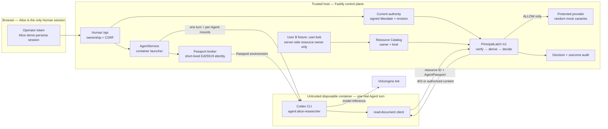

# PrincipalLatch — one-page architecture

Judge-ready exports: [PDF](../output/pdf/PrincipalLatch_Architecture_One_Page.pdf)
and [high-resolution PNG](../output/pdf/PrincipalLatch_Architecture_One_Page.png).
They are reproducibly generated by
[`scripts/generate-architecture-pdf.py`](../scripts/generate-architecture-pdf.py).

**Track:** TikTok TechJam 2026 — Track 1: Bouncer
**Claim:** Agent identity is necessary but not sufficient. Every protected read
also needs a current, signed delegation evaluated at the backend boundary.



## Concrete identity model

```text
Browser fixture: user:alice                 (only Human session)
Server fixture:  user:bob                  (negative-control resource owner)
Agent principal: agent:alice-researcher     (owned by Alice)
Agent Passport:  Agent + acts-for + session + Mandate + ≤300 s lifetime
Signed Mandate:  principal × Agent + lifecycle + revision + profile commitment
Decision facts:  action from route; owner/kind from trusted Resource Catalog
```

The Alice fixture session is not production authentication. Bob has no browser
login and is not a second tenant or Agent Team member; his resource proves the
official cross-user deny case.

## Backend decision sequence

1. Verify strict Passport header/claims/signature/time window and active session.
2. Load the current Mandate; the Runtime cannot choose its body or revision.
3. Verify signature, exact binding, lifecycle, revision, profile commitment, and
   consistency with the trusted local issuer key/ID/fingerprint. There is no
   independent external trust root or HSM.
4. Derive `document.read` from the route and owner/kind from the catalog.
5. Persist deny + `not_attempted`, or allow + `attempting`, before provider
   access. Persist terminal `succeeded`/`failed` separately.
6. Return protected content only on allow; audit failure fails closed.

## Evidence state machine

| Current-rehearsal event | Backend result | Provider result |
| --- | --- | --- |
| Turn 1: Agent → `alice-doc-001` | `ALLOW_SCOPE_RULE` | `succeeded` |
| Turn 1: same Agent/Passport → `bob-payroll-001` | `DENY_OWNER_MISMATCH` | `not_attempted`, Bob reads `0` |
| Alice revokes current Mandate | Passport remains unexpired | No provider call |
| Turn 2: same Agent/Passport → `alice-doc-001` | `DENY_MANDATE_LIFECYCLE` | `not_attempted` |

`Fresh rehearsal` preserves/revokes the predecessor, issues a new linked active
successor, invalidates the old Passport session, resets the Agent's Codex thread
reference, and scopes new evidence to the successor. It never reactivates a
revoked Mandate.

## Data and trust placement

| Data | Trusted host | Agent container | Browser / application evidence |
| --- | :---: | :---: | --- |
| Passport/Mandate signing seeds | Yes | No | Not returned |
| Current Mandate, Resource Catalog, protected-content file | Yes | No | Safe summaries/catalog metadata only |
| Raw Agent Passport | Issued here | Environment | Application exposes only `jti`, expiry, SHA-256 commitment |
| Ark key | Launch source | Environment | Redacted from captured application output |
| Per-Agent workspace/Codex home | Selected paths | Mounted | Persistent; may contain authorized content |
| Authorized Alice content | Provider | Returned after allow | May persist in Agent output/state; mock data only |

The supported path is trusted host Fastify + one disposable Docker/Podman
container per turn. Host `local-process`, all-in-one deployments, and public
cloud are not supported or verified security profiles. Containers remain a
hackathon boundary, not hardened hostile multi-tenant isolation; outbound
networking, JSON storage, and a restart-local per-IP limiter are disclosed
limitations.
Application redaction does not cover container-engine, host-admin, or external
telemetry.
